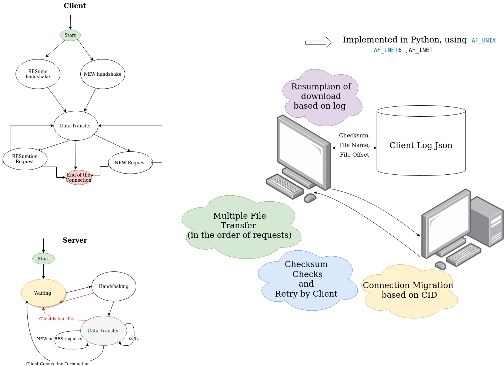

# The Robust File Transfer protocol
This protocol is designed for file transfer with robust transfer behavior. It supports: 

* Connection setup 
* File transfer with different environment
* File resumption when interrupted 
* Check File Changed before resumption
* Connection Migration (recovery IP-Address Change/Connection Drop)
* Muilti-file transfer
* Abort (gracefully exit)
* Connetion close 
* Handling different packets within Protocol
* Flow control 
* Congestion Control 
* Checksum checks for the received files 

Further information has been declared in the prorocol specification.
# Overview 
The details are being introduced in the rfc specification of the protocol.Here is a summary of the project aspects, phases in the following listed are the main part of the design :

<details>
<summary>Endpoint setup</summary>
<p>By running the program,we first setup the server as well as the client. Server will first pending when there's no incoming packets</p>
</details>

<details>
<summary>(New/Resumption) Handshake </summary>
<p>Client send file request to the server and make sure it contains the information needed(in rfc file).Server will check the validity of the incoming packet and send corresponding packet back to client. Then client check again the server response and do the behavior as designed</p>
</details>

<details>
<summary>Data Transfer </summary>
<p>The server sends packets in an AIMD(Additive Increment Multiple Decrement) behavior and Client sends Acknoledgements back, meanwhile handles different incoming packet and changing it's behavior accordingly. if file transfer is coompleted, the server will whether continue with the next file transfer or tell client to stop the connecton</p>
</details>

<details>
<summary>Connection close </summary>
<p>when sever sends the close connection message Client will disconnect and server goes back to pending  </p>
</details>

## Architechture

The base Architechture of the project is using normal Client - Server pattern.
We set individual class to generate the packet.We save the intermediate information to extra file when misbehavior happens that stops the transfer.
Besides,we using extra thread for handling the receing buffer as well as sending buffer and doing corresponding IO function. Both client and server aggregat the threads.
The following diagram shows that client and server 's behavior and the state machine of each side.


## Things we learned 
In the projects phase there's some key features that we earned,so everything that we learned will become part of ourknowledge and will be used in the future development: 
1. socket programming: handle sockets behavior 
2. protocol syntax and encoding 
3. options negotiation
4. congestion control/flow control mechenism 

# Usage 
## specifications 
Running Server : 
```
rft [-s] [-t <port>] [-p <p>] [-q <q>] [-ls] ...
```
Running client: 
```
rft <host> [-t <port>] [-p <p>] [-q <q>] <file> ...
```

Argumentation list: 

arg | descripton
----|-----
 -s | server mode: accept incoming requests from any host Operate in client mode if “–s” is not specified.
 <'host'> | The host to request from (hostname or IPv4 address).
 -t | Specify the port number to use (use a default if not given).
 -p, -q | Specify the loss probabilities for the Markov chain model.If only one is specified, assume p=q; if neither is specified assume no loss.
 <'file'> | The name of the file(s) to fetch 
 -v | Show packet including payload in debug mode
 --write | Show write queue and write operations in debug mode 
 --recv | Show received packet in debug mode
 --cwnd | Show information for the congestion window in debug mode
--force | Remove all requested files on the client side before starting the transfer
--debug | Show debug information
-ls | List files on server

## examples
```python
Client:  python3 implementation/rft.py ::1 test.png
Client Multifile: python3 implementation/rft.py ::1 test.png test.pdf
Server:  python3 rft.py -s
```

